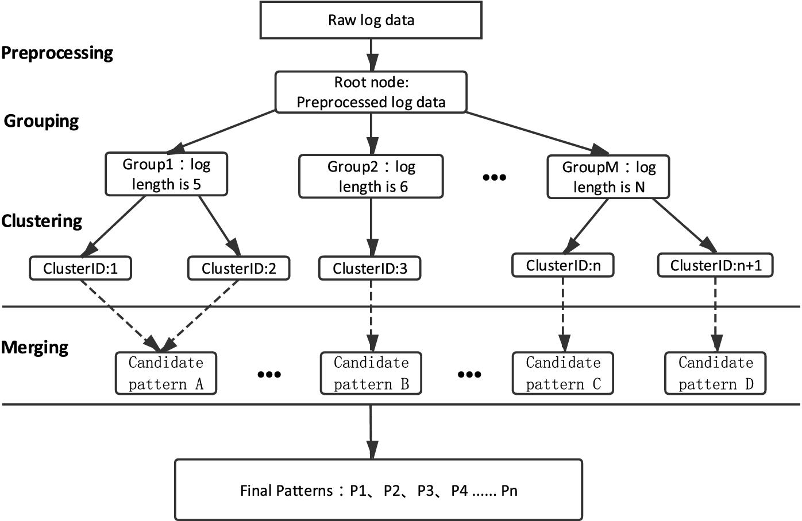
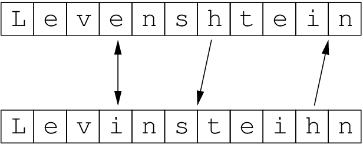

# Clustering Details

When a new log passes through the pipeline, the variants are identified via a proprietary Ragel FSM Based Tokenization process \(80%-90% more efficient than regex\) and stripped from the log, replaced with wildcards, and the remaining invariant components of the log are then compared to existing pattern sets to determine their similarities.

There are modes for calculating similarities:

* [Drain](https://docs.edgedelta.com/appendices/clustering#drain)
* [Levenshtein Distance](https://docs.edgedelta.com/appendices/clustering#levenshtein-distance)

The goal of calculating similarities is to transform raw log messages into structured log messages by clustering them based on their similarities.

## Drain

Drain is the default algorithm.

Drain is a log parsing algorithm that we used for clustering logs, it is based on parse tree with fixed depth to guide the log group search process, which effectively avoids constructing a very deep and unbalanced tree.

When a new raw log message arrives we preprocess it with Ragel FSM Based Tokenization process. Then we search a log group \(i.e., leaf node of the tree\) by traversing the nodes of the tree based on the token prefix. If a suitable log group is found, we also calculate the similarity between the log message and the log event stored in log group. If the similarity threshold is above certain threshold then the log message will be matched with the log event stored in that log group. Otherwise, a new log group will be created based on the log message.

To accelerate this process we design a parse tree with fixed depth and nodes with fixed children to guide the log group search, which effectively bounds the number of log groups that a raw log message needs to compare with.

Since we use drain log parse tree for clustering based on the common prefix, we can easily merge the clusters by using their ancestors in the tree. Merge level determines how many level we will go up in the tree.

## Levenshtein Distance

Levenshtein distance is a string metric for measuring the difference between two sequences. The Levenshtein distance between two words is the minimum number of single-character edits \(insertions, deletions or substitutions\) required to change one word into the other.

When a new raw log message arrives we preprocess it with Ragel FSM Based Tokenization process. Then we use Levenshtein distance algorithm for calculating similarities between tokens, and if similarity is above certain threshold then we decide that these logs belongs to the same log group. The similarity calculation is based on minimum number of operations required for making two tokens same. If required operation number is below certain threshold, then they are more similar and grouped in same log group. Otherwise, a new log group will be created based on the log message.

