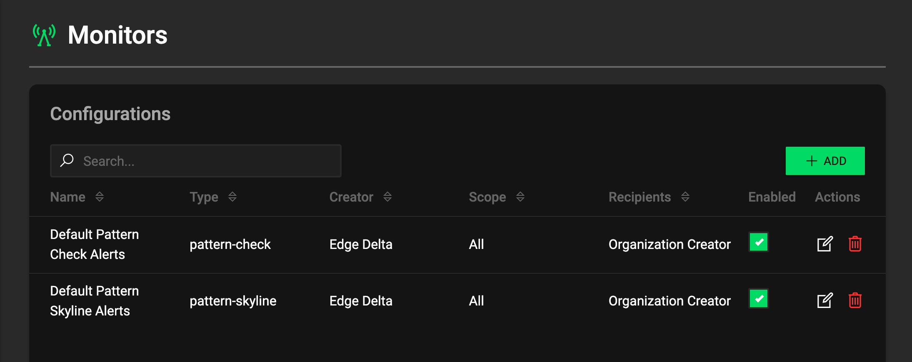
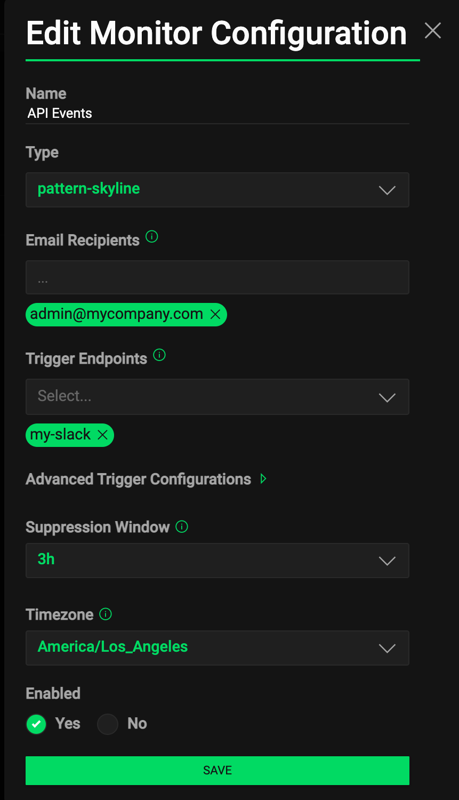
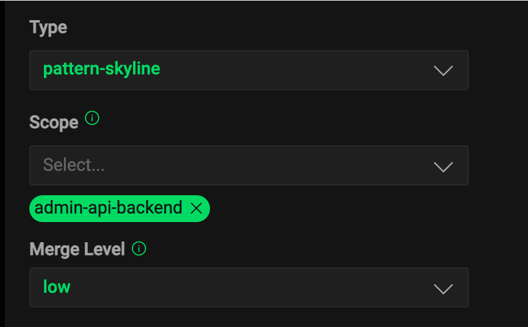

# Monitors

Edge Delta collects and analyzes logs and metrics via agents to provide valuable insight about the monitored systems. Monitors is a mechanism to notify Edge Delta users about significant changes in the systems without having to track it manually using the web interface.

Monitors provides actionable insights by exposing anomalous behaviours identified using seasonal data such as:

* Collective negative sentiment increase in system logs
* Individual negative sentiment increase in individual system events
* Correlated increase in agent signals from different individual source such as negative metrics hitting thresholds
* Anomalies in system wide monitored metrics

All monitors created on the system are visible on [Monitors Page](https://admin.edgedelta.com/monitors). By default there are two monitors defined for each organization sending notifications to the organization creator.

To create a new monitor click **+ Add Button** on [Monitors Page](https://admin.edgedelta.com/monitors). Custom Metrics monitors can be only created [Metrics Page](https://admin.edgedelta.com/metrics)

To edit an existing monitor click the edit button\(pencil icon\) next to the monitor in the table.

## Common Monitor Configuration

All monitor types have below configuration fields:

| Field | Description |
| :--- | :--- |
| Name | Given monitor name |
| Type | Monitor type that can not be changed once monitor created |
| Email Recipients | Emails that will get notified by his monitor |
| Trigger Endpoints | Previously configured notification channels that will be notified by this monitor such as Slack |
| Advanced Trigger Configurations | Customized template body to be send to Slack channel using available template variables |
| Suppression Window | Suppression period in hours that will prevent notifying similar alert more than once in short notice |
| Timezone | Timezone that will be used in prerendered charts in notifications body |
| Enabled | If set **No** monitor will stop sending notifications |

## Monitor Types

### Pattern Skyline

Pattern Skyline monitor processes the collected event patterns with negative sentiment from multiple sources continuously and notifies the anomalies in different types of events collectively. This monitor does not require any agent configuration to function. By default agents configured and collecting logs from different sources will send analyzed event patterns to the backend to be used by this monitor.

Pattern Check monitors have below configuration options:

| Field | Description |
| :--- | :--- |
| Scope | Source tags where events will be collected and analyzed in. See [Agent Settings](../configuration/agent-settings.md) about tags |
| Merge Level | Merge level sets the eagerness to cluster similar logs as log patterns centrally. Level none disables central clustering for this monitor |

### Pattern Check

Pattern Skyline monitor processes the collected event patterns with negative sentiment from multiple sources continuously and notifies the anomalies in individual outlying events. This monitor does not require any agent configuration to function. By default agents configured and collecting logs from different sources will send analyzed event patterns to the backend to be used by this monitor.

Pattern Check monitor has the same options with Pattern Skyline.

### Custom Metrics

Custom Metrics monitor processes the cumulative value of a specific metric in the provided scope. Instead of just signals, this monitor processes actual metric to define scope wide threshold with fine grained control. Custom metrics can be edited and deleted on [Monitors Page](https://admin.edgedelta.com/monitors) page but creation should be done on [Metrics Page](https://admin.edgedelta.com/metrics). For further information about how to create Custom Metrics Monitors see [Custom Metrics](custom-metric-alerts.md).

