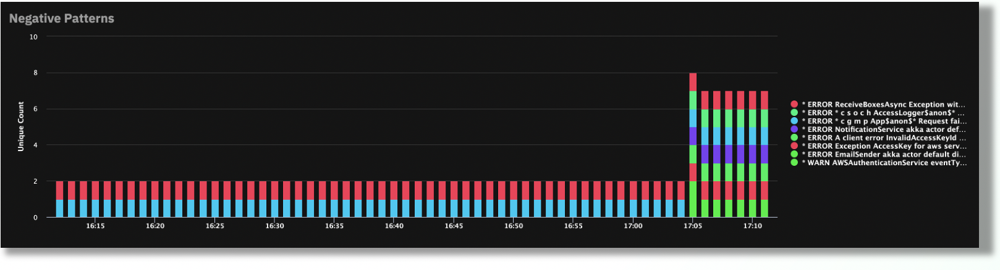
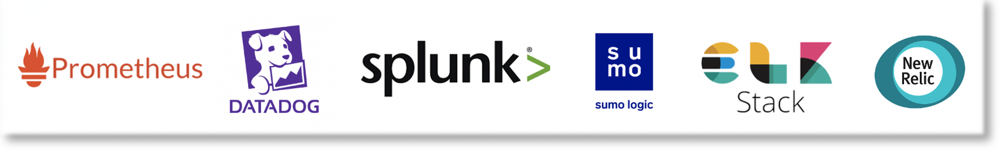

# Architecture Overview - K8s

There are a number of different architectures for deploying Edge Delta. Whether you are running a monolithic Linux or Windows based application environment, or a fully containerized, microservice based Docker or Kubernetes environment, they are all fully supported by the Edge Delta platform.

The goal of this document is to provide a high level overview of a typical Edge Delta deployment in a Kubernetes cluster, and each of the components that make up the deployment.

The setup process for deploying Edge Delta within a Kubernetes cluster is simple, and natively leverages Kubernetes APIs and other components to provide a seamless onboarding, and automated monitoring experience.

Many of the commonly used Kubernetes Services are fully supported by Edge Delta:

* **Amazon EKS**
* **Azure AKS**
* **Google GKE**
* **OpenShift Enterprise Kubernetes**
* **Bare Metal Kubernetes**

## Edge Delta Agents

A primary component of the Edge Delta deployment \(in the context of Kubernetes\) are the Edge Delta agents. The agents are an extremely lightweight, low-resource, Go-based process that run as a **Daemonset** in a Kubernetes cluster \(1 pod per node\).

## Edge Delta Kubernetes Input

Once the Edge Delta daemonset is running within a Kubernetes cluster, telemetry data \(logs and metrics\) generated by other pods in the cluster are automatically monitored and analyzed by the Edge Delta agents in realtime. The Edge Delta agents are automatically aware of the Kubernetes components of the cluster \(pods, namespaces, deployments, etc.\) natively by utilizing the [Edge Delta Kubernetes Input](./configuration/inputs.md#kubernetes). The Kubernetes Input has many flexible configuration parameters, allowing users to include/exclude monitoring for specific pods, namespaces, etc., but by default the agents will automatically detect all running pods within all namespaces.

In addition to automatically monitoring and analyzing telemetry data from the running pods within a cluster, **the Edge Delta service will automatically generate and tag the analytics with rich Kubernetes native metadata**.

Example components include:

* **Pod** related metadata \(name and ID\)
* **Namespace** related metadata
* **Controller** related metadata \(name and type\)
* **Container** related metadata
* **Deployment** related metadata
* **Labels** related metadata \(custom and default\)

## Edge Delta Kubernetes Deployment Overview

There are a number of different ways to deploy the Edge Delta service in a Kubernetes environment. The three most common approaches for deploying Edge Delta in Kubernetes are via direct kubectl Apply commands, using Helm, or via Terraform.

Deployment Overview Steps:

* [Kubectl Deploy Commands](./installation/kubernetes.md)
* [Helm Charts](./installation/helm.md)
* [Terraform](./installation/kubernetes.md)

## Edge Delta Automated Kubernetes Monitoring

Once the Edge Delta service is running within your Kubernetes environment, we automatically begin analyzing and monitoring telemetry data locally from the active pods within the cluster using Edge and Stream Processing concepts. The incoming data is enriched with detailed metadata from the environment, and analyzed within the context of low level tags, as well as broader logical groups.

Without any custom configuration, or user-provided context of the environment, the Edge Delta service will begin analyzing the underlying data, generating patterns, findings, and statistics, as well as **baselining the behavior to provide automated Anomaly Detection and Machine Learning capabilities**.

Insights, Statistics, Patterns, and Findings generated by Edge Delta are streamed in realtime to [Streaming Destinations](./configuration/outputs.md#streaming-destinations), which are typically the existing Monitoring platform you are used to using \(i.e. Elastic, Splunk, Datadog, Sumo Logic, New Relic, Prometheus, etc.\). Additionally, these insights are automatically exposed in the Edge Delta UI, with flexible filtering, aggregation, and other commonly used investigation tools. There is no requirement to store any raw data on the Edge Delta backend, typically only statistics, system state, metadata, and other higher level components are streamed to Edge Delta for analysis. The volume of data transferred from Edge Delta agents to Streaming Destinations is typically negligible, regardless of the volume of raw data analyzed. **For example, 1TB/day of raw data analyzed by Edge Delta may result in 1-2GB/day of realtime insights, statistics, patterns, and findings sent to configured Streaming Destinations.**

The below \(Automated Pattern Detection\) is just one of many examples of the automated monitoring capabilities that Edge Delta provides without any initial configuration, or context about your environment.

**Native Streaming Destinations Include**

