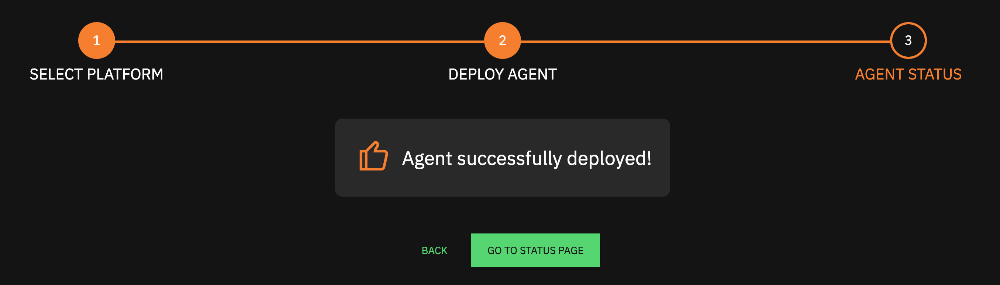

# Basic Onboarding

## Create An Edge Delta Account

1. Navigate to [admin.edgedelta.com](https://admin.edgedelta.com/)
2. At the bottom of the Sign-In dialog, hit the _**Sign up**_ button to start the process
3. Once you have completed all of the steps for signing up, your account will automatically be created

## Follow The Onboarding Setup Wizard

After initial deployment, the onboarding wizard can be accessed via [admin.edgedelta.com/onboarding](https://admin.edgedelta.com/onboarding)

**1.\) Select an Operating System or Architecture Type for Deployment**

**2.\) Copy Pre-configured Deploy Command\(s\) and Run In Appropriate Terminal**

**3.\) Wait a few seconds for agent\(s\) to deploy and authenticate with the Edge Delta Backend, and navigate to the Status Page to get started!**

## Deploy From Existing Configuration

1. Navigate to the [Configurations](https://admin.edgedelta.com/configurations) view of the Edge Delta service
2. Identify the appropriate configuration you would like to use for deployment, or create a new configuration
3. Hit the **Deploy** button on the right-hand side of the configuration

1. **Copy** the appropriate deployment command \(based on the OS of the server Edge Delta will be deployed\)

1. Run the deployment command on the target server or cluster to deploy Edge Delta
   1. Docker, Linux, and MacOS: paste and run the command in the terminal 
   2. Windows: Open Powershell, paste and run the command
2. Congrats! You have now deployed your first Edge Delta agent\(s\)

## Verify Successful Deployment

**Within Edge Delta**

1. Navigate to [admin.edgedelta.com](https://admin.edgedelta.com/), and log back in if needed
2. Click the Home tab at the top of the UI
3. After a successful deployment, the Agents Deployed panel should display a value of one, and the Host Name of the deployment server, as well as other statistics should be displayed in the Agents section of the dashboard. The Bytes analyzed and Events analyzed values will most likely read non-zero values as well, however these could continue to remain empty depending on your configuration settings. 

**Within Configured Streaming Destination**

1. Log in to the configured Streaming Destination \(Output\) platform \(i.e. Splunk, Sumo Logic, Datadog, New Relic, etc.\)
2. Once logged into the appropriate platform, identify the appropriate source metadata to query for incoming Edge Delta data \(this source should match the source configuration details provided in the configuration file \(i.e. HTTPs Endpoint, HEC endpoint, API URL, etc.\)
3. Query the source that is configured to receive incoming Edge Delta data
4. Review query results. Incoming data should contain metadata tags that match the labels and tags defined in the configuration file

## Troubleshooting

**Detecting An Issue Occurred With Deployment**

* Run command in terminal failed with output message
* No agent appeared in the Edge Delta UI
* No background service is running on target host
* No data is being reported to streaming destination

If any issues appear after deploying the agent, view troubleshooting section for given OS of agent deployment \(see [Installation](./installation/README.md) documentation, select appropriate OS, and navigate to _**Troubleshooting**_ section of documentation\)

