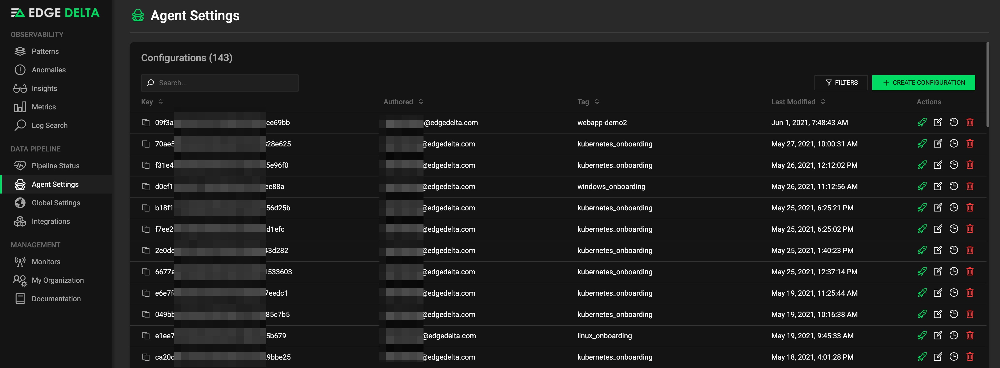
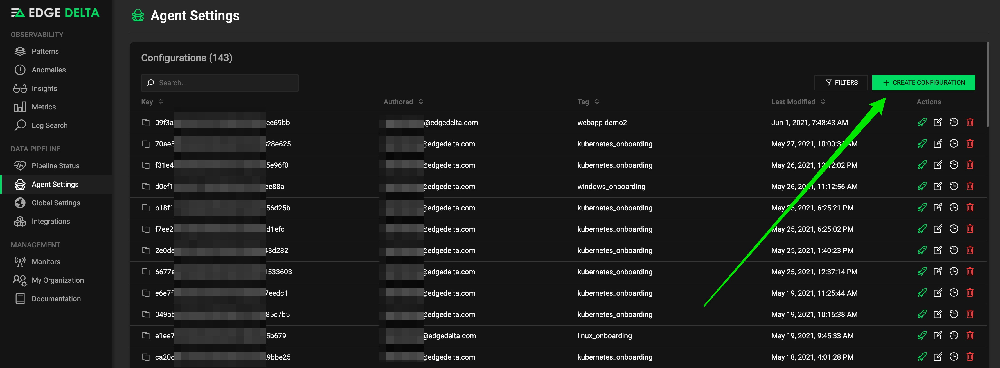
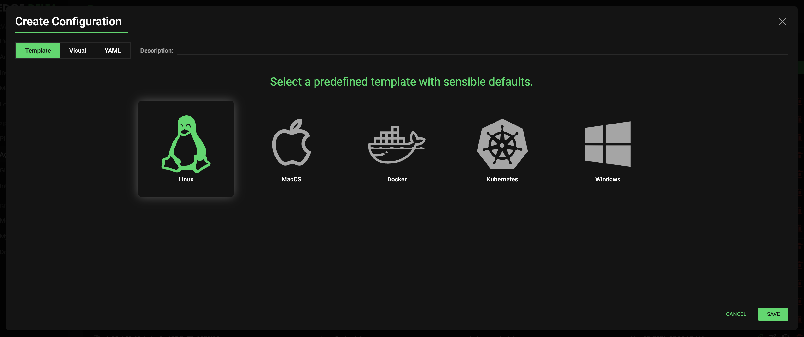
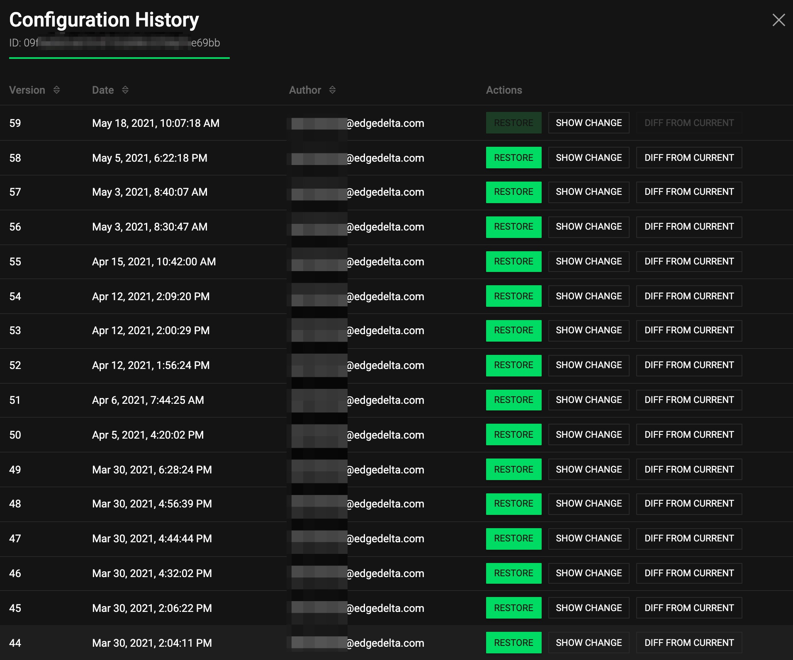
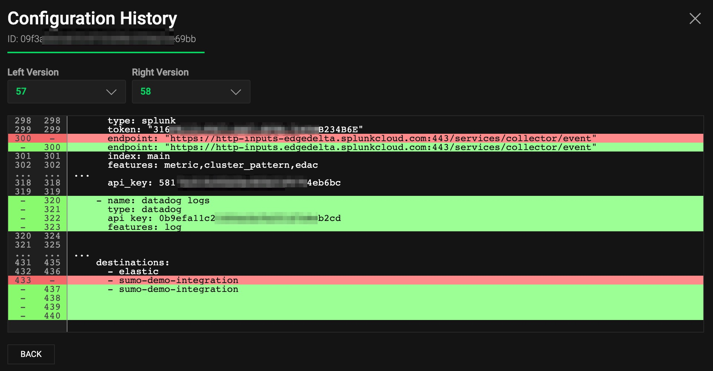

# Cloud Configuration Backend \(CCB\)

The Edge Delta Cloud Configuration Backend \(CCB\) is a service provided by Edge Delta to help with the process of generating and deploying configuration files utilized by the Edge Delta service.

With CCB, users can use the Edge Delta UI to create and manage configuration files, as well as automatically generate configuration API Keys used to pre-configure agents upon deployment.

Additionally, CCB allows users to update and modify configuration files directly through the UI, automatically propagating changes down to running agents.



## Creating a New Configuration

In the Edge Delta admin portal, click the green "Create Configuration" button in the top right corner to generate a new configuration.



Start with a template or create your own from scratch:



Once you've saved your configuration, you will return to the configuration portal, where your new configuration will be listed, as well as an API Key associated with the configuration.

The API Key is utilized as part of the agent deployment process, allowing new agents to install and deploy pre-configured based on a configuration from the portal.

## View Configuration History

All configuration changes are tracked and auditable in the Edge Delta UI:



Individual changes can be shown, or you can diff a specific version from current:



## Updating an Existing Configuration

To edit an existing configuration, hit the Edit button to the right of the configuration you wish to edit.  Once you've made your changes, hit the green Save button in the bottom right to save your changes.

After an existing configuration has been updated via the UI, the updated configuration version will automatically be propagated down to running agents using that API Key. The agents will check back with the CCB and will pull updates as required. Typically the update will take place within approximately one minute or less. 

## Local Configuration File Management

In addition to the Cloud Configuration Backend \(CCB\), Edge Delta also supports the ability to manage and deploy configuration files locally if preferred, using tools like Chef, Puppet, Ansible, Salt, Terraform, etc. 

In order to provide the configuration locally, a flag must be provided at agent deploy time to let the system know Local Configuration File Management is in place.

 **Run Parameter:**

-c path/to/config.yml

**Linux Example:** .

```text
./edge_delta.sh -c /opt/configs/edge_delta.yml
```

**Windows Example:**

```
start /wait msiexec /qn /i edgedelta-version_64bit.msi -c /opt/configs/edge_delta.yml
```