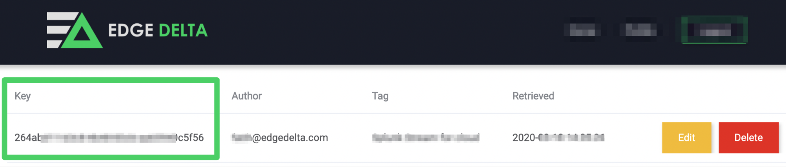

# Docker

Edge Delta has a Docker container image that can be deployed as a Sidecar or DaemonSet architecture to analyze telemetry from other Docker containers running on the host, while providing isolation and encapsulation.

## Running the Container

_**Note**: The following steps below can be automated by selecting the 'Deploy' button on the right-hand side of a given configuration in the Edge Delta Admin Portal. After hitting the 'Deploy' button, a dialog box will appear with a pre-configured Docker run command containing the appropriate API Key for deployment. Simply run that command on the host you want to deploy Edge Delta on, and the installation / deployment process will begin._

When it is time to run the Edge Delta container, you can either have the Edge Delta container fetch its configuration from the Edge Delta Central Configuration Backend \(recommended\), or use a local configuration file.

### Run with an API Key Utilizing Central Configuration Backend \(CCB\)

Replace the &lt;YOUR\_API\_KEY&gt; field from the command below with your configuration API Key from the administration portal:



Container must have internet access to fetch the configuration.


More information about [CCB](../configuration/ccb.md) can be found under [Configuration](../configuration/) section


```text
docker run -it \
-v /var/run/docker.sock:/var/run/docker.sock:ro \
-e "ED_API_KEY=<YOUR_API_KEY>" \
docker.io/edgedelta/edgedelta/agent:latest
```

### Run with a Local Configuration File

Replace `$PWD/config.yml`with absolute path of the local configuration file on host.

```text
docker run -it \
-v /var/run/docker.sock:/var/run/docker.sock:ro \
-v $PWD/config.yml:/edgedelta/config.yml \
docker.io/edgedelta/edgedelta/agent:latest
```

## Limiting Resource Consumption

You can limit the CPU or memory resources that Edge Delta container consumes. In example below we are limiting Edge Delta container to utilize maximum 25% CPU and 256 MB of memory.

```text
docker run -it --cpus=".25" --memory="256m" \
-v /var/run/docker.sock:/var/run/docker.sock:ro \
-v $PWD/config_docker.yml:/edgedelta/config.yml \
docker.io/edgedelta/edgedelta/agent:latest
```

## Troubleshooting

Check to see if the agent's container is running by running the following Docker command, if the container is running, a container containing edgedelta in the IMAGE name should appear in the list:

```text
docker ps
```

Check the agent's log file for any errors that may indicate an issue with the agent, configuration, or deployment settings.

Run the following command to view all containers \(whether running or not\), this will be used to capture the CONTAINER ID of the Edge Delta agent

```text
docker ps -a
```

Copy the CONTAINER ID of the Edge Delta agent \(should be listed at the top of the list of containers\)

Run the following command using the agent's CONTAINER ID

```text
docker logs CONTAINERID
```

