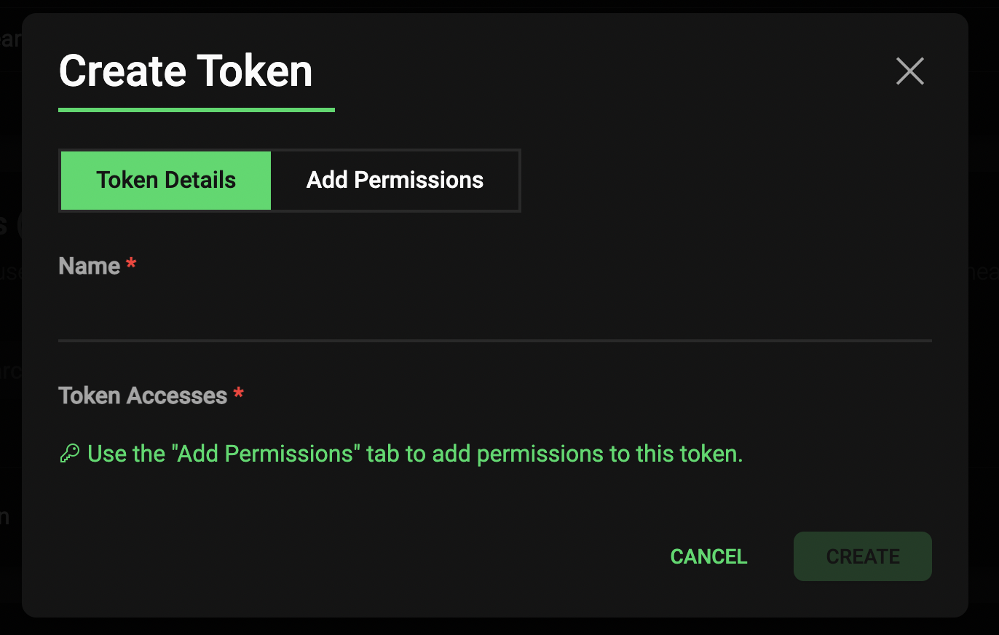
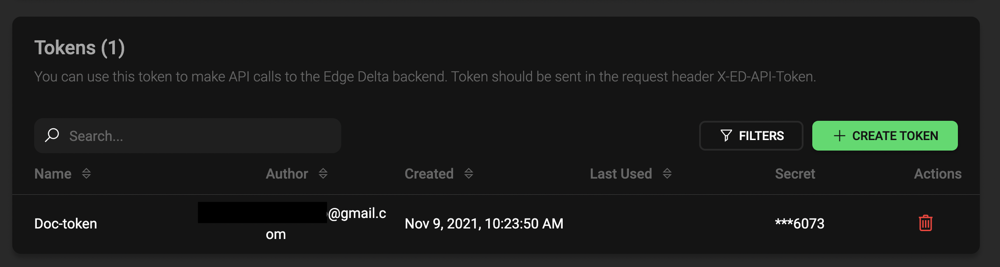
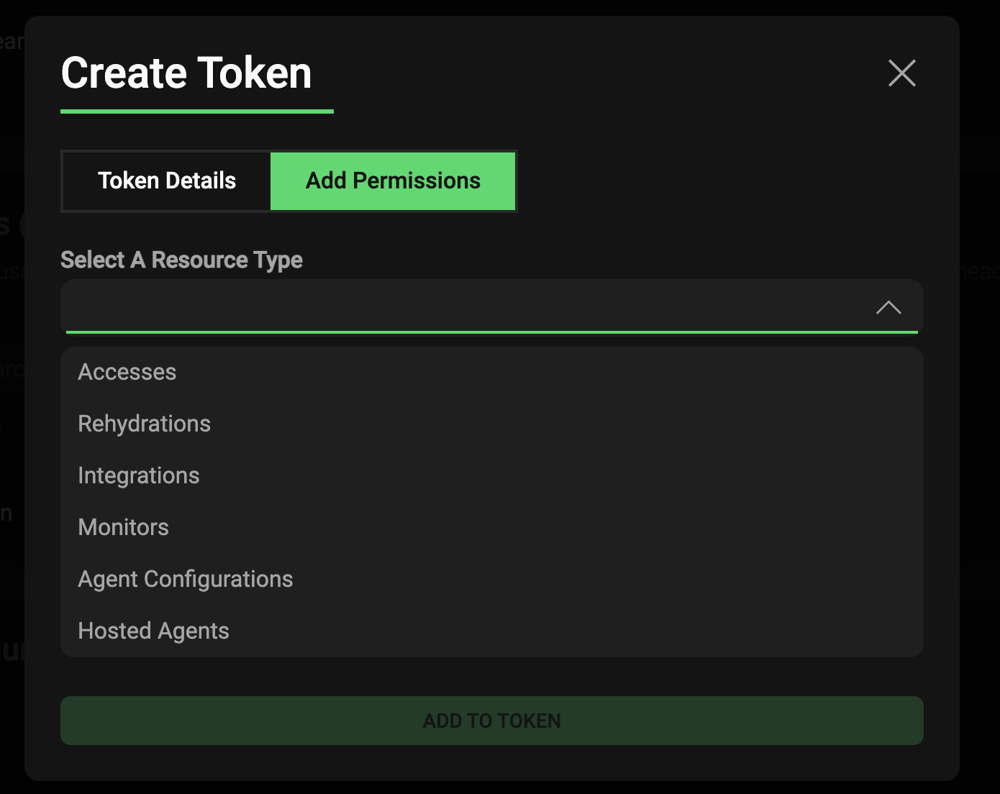

## November 9, 2021 - Create a Token

In the Edge Delta Admin portal, you can create a token to give your users specific access to the Edge Delta API system. 

With tokens, you can specify read / write access for specific backend functionality for your users. In other words, you can create a token to give your users specific read / write access to the Edge Delta API system. 

To learn more, see [Tokens](.appendices/tokens.md). 

***

