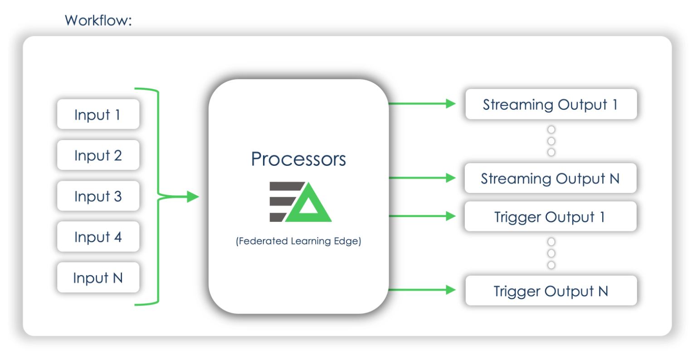

# Edge Delta Overview

## What is Edge Delta?

In today's modern architectures, whether your infrastructure is physical, virtual, on-premise, in the cloud, containerized or serverless, applications and systems produce a large volume of telemetry \(logs, metrics, events, traces, etc.\). Real-time analytics and stream processing are used to capture the current state of these systems and provide intelligent insight. This empowers teams to be able to observe, monitor, predict, alert, and remediate in an automated manner, ensuring uptime and availability of critical production systems.

Edge Delta is an automated observability platform that gives enterprises distributed stream processing, federated machine learning, and intelligent data pipeline capabilities. Decoupling where data is analyzed from where it is stored empowers DevOps, Security, and SRE teams to consume and optimally route all forms of machine data output \(logs, metrics, traces\) with the scalability and efficiency to eliminate technical and financial limits. This results in organizations that can identify and remediate operational and security incidents more accurately, orders of magnitude faster and more securely than previously possible with traditional centralized systems like Splunk, Datadog, and Elastic.

## **Limitations of Central Systems**

Operational use cases with an inherently higher reliance on real-time insights are forcing engineers today to make difficult decisions around how their production monitoring systems are architected. The exponential growth of data has made the traditional centralized approach of sending all logs, metrics, and traces to a one-size-fits-all data lake has become both technically limited and financially infeasible. This has led to organizations going through the endless exercise of trying to predict which machine data sets surpass the value threshold required to qualify for premium storage tiers, and which are relegated to cold options.

## A Brand New Approach

Before Edge Delta, the traditional centralized platforms had limitations which forced teams into making concrete decisions that forced engineering teams into rigid data pipelines. Edge Delta is taking a modern approach to observability by giving enterprises the ability to use distributed stream processing and federated machine learning capabilities for intelligent, dynamic, and automated data routing to optimal destinations. Rather than neglecting datasets to solve for technical and financial constraints, organizations now have access to limitless analytics and unparalleled visibility leading to significant operational efficiencies previously not possible.

Modern enterprises and leaders in the market are making significant investments in their observability teams. Integrating, enriching, and improving the capabilities of conventional platforms such as Splunk, Datadog, Elastic, New Relic, and Sumo Logic - Edge Delta now provides companies with distributed stream processing, federated machine learning, and intelligent observability pipelines to achieve the insights and context to make better decisions. This innovative new approach allows DevOps, Security, and SRE teams to analyze large volumes of streaming data without the cost, delay, or complexity of requiring data to be indexed, helping customers decouple where machine data is analyzed from where it is stored.

## Distributed Intelligence - Four Stage Approach

## Typical Architecture

For a standard installation, the analysis initially starts at the agents, where raw logs, metrics, and telemetry is pre-processed and applied to both streams and triggers:

The agent analyzes all data in real time, where it then can feed the Anomaly Captures, Analytics and Insights, and Alerts and Automation into existing systems.

The raw data on the other hand can be forwarded to low cost analytics tiers of existing monitoring platforms \(search-only, infrequent, ingest-only, etc.\) as well as storage solutions that have re-ingestion, re-indexing, or dynamic searching capabilities. \(Snowflake, S3, Blob Storage, etc\).

## Planning and Design

The Edge Delta agent is built with the ["Go" programming language](https://golang.org/), making it extremely performant, efficient and lightweight. The agent doesn't require installation \(but installers can also be used\) and runs as a background process. The Edge Delta Federated Learning backend can be supported on AWS, Azure, GCP, as well as On-prem if required.

\(Typical\) If the agents have outbound internet connectivity, Edge Delta Central Configuration Backend \(CCB\) can be used to simplify configuration file changes especially in environments with many Edge Delta agents. CCB is a cloud service run by Edge Delta. Configuration files changes can be securely uploaded to this service, once uploaded, during runtime Edge Delta agents can pull the configuration file from the CCB service. More information how to configure CCB can be found under the [Configuration](https://docs.edgedelta.com/configuration) section of the documentation.

\(Atypical\) If the agents do not have outbound internet connectivity, the Edge Delta agent works with a local configuration file \(config.yml\).

In either deployment model, the configuration file is used to configure the global settings for the agent, sources used by the agent \([Inputs](https://docs.edgedelta.com/configuration/inputs)\), monitors/rules performed by the agent \([Processors](https://docs.edgedelta.com/configuration/processors)\), and the destinations where analytics, insights, alerts and automation are streamed \([Outputs](https://docs.edgedelta.com/configuration/outputs)\).

In cases where there is no outbound internet connectivity, the configuration file is created automatically after installation and loaded into memory at runtime. After making changes to the `config.yml` file, the changes are loaded on agent process restart.

